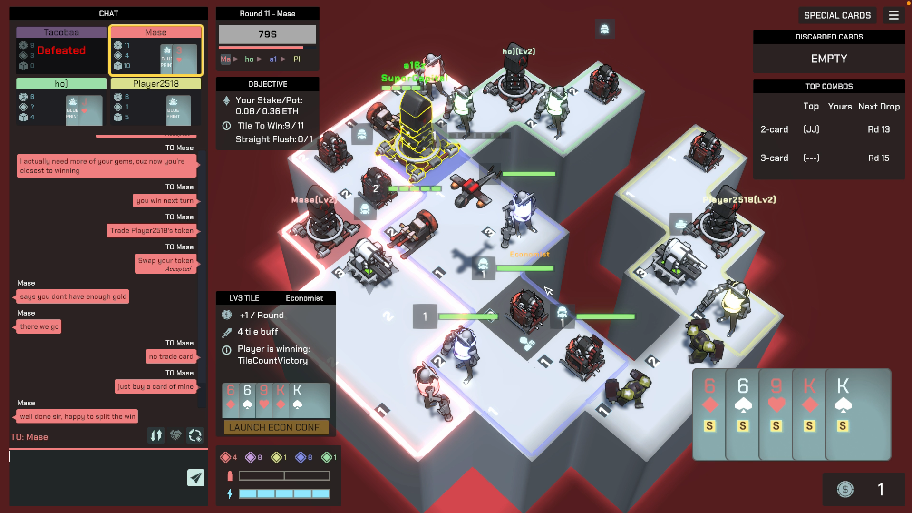

# Quick Start

Duper is a competitive social game where you can win real money.

**<u>This is the only page you need before playing your first Duper session.</u>** Even though Duper has a lot of strategic depth, you can start playing with just a few key concepts. After finishing this page, go on the [game website](https://play.duper.gg), create an account, and try the Playground mode. Explore the actions first, then try to beat the AI. Don't be frustrated if you fail in the first few attempts — most people do!

After you've beaten the AI, play a Casual session with real players. This is without real money, so you can continue to practice your skills and observe how the social diplomacy plays out. When you're ready, transfer some Arbitrum ETH into your Privy wallet and deposit it into the game contract to play a Ranked session. Survive the lies ✦

Whenever you have questions about rules, come back and refer to the [Game Wiki](./wiki) up next.

### What is Duper?

**Duper is an onchain stake-based social war game.** It contains elements from wagering games like Poker, strategy games like Civilization and Into the Breach, and board games like Diplomacy and Catan.

Each game session hosts 5 players and lasts ~40 minutes. Each player enters a game with real stake (currently 0.005 ETH minimum) and gems representing “equity”. Duper is NOT a winner-take-all game: When a game ends, only one player wins, but the pot is divided based on how many winner’s gems each player holds. _The winner may not be the biggest earner._

The most interesting element in Duper is the social diplomacy — secret alliances from resource exchanges, stemming conspiracies, and outright backstabbing are not only allowed, but _encouraged_, in Duper. Survive the lies.

### Game Elements

There’s a strategy game component (produce troops and buildings, expand territory, and fight) and a diplomacy game component (chatting and trading).

There’re 3 important resource types in Duper:

1. Gold: generated from capitals, level-3 tiles, and economists; used for production.
2. Card: given at beginning of rounds to each player; used for production.
3. Gem (like equity): minted by each player at game start and also if/when a player raises (add more stake); used to settle game payout.

### How to Win

There are two ways to win: either own 12 tiles, or collect a 5-card straight flush. The game ends when a player wins.

### How to _Earn_

_Winning and earning are completely separate in Duper._

Let’s say Alice wins in a game. Alice first gets back her stake. The rest of the pot is split between everyone based on how much gems they own that are minted by Alice. For example, if Bob owns 5 out of 10 Alice-minted gems, then Bob gets half of the remaining pot.

What does that say about how you should play? Make your judgment how who’s likely to win at all times, and try to get their gems by trading with them and letting them trade with you.

### Social Diplomacy and Deception

Forming soft alliances with another player through owning each other’s minted gems is helpful, because regardless of who wins among the two of you, you both get positive returns. However, gem portfolio is hidden for other players, so you can always choose to switch alliance, and others may do the same. Someone may even offer you lots of gems to get you to help them, and right before they win, they take out your capital by surprise and take back their minted gems, so they earn more. This endless persuasion, trading, and deception form the backbone of Duper.

### Tips for a newbie

1. Prioritize conquering barbarian tiles over player tiles, because you don’t get rewards conquering player tiles.
2. Mark your cards as for sale so other players may trade cards with you (and you also get a gold reward)
3. Pay attention to your gem portfolio and all players’ tile counts at all times.
4. If you ever feel stuck, don’t worry, Duper is early so there could still be UI inconsistencies or even minor bugs. Let us know and we appreciate your feedback!
